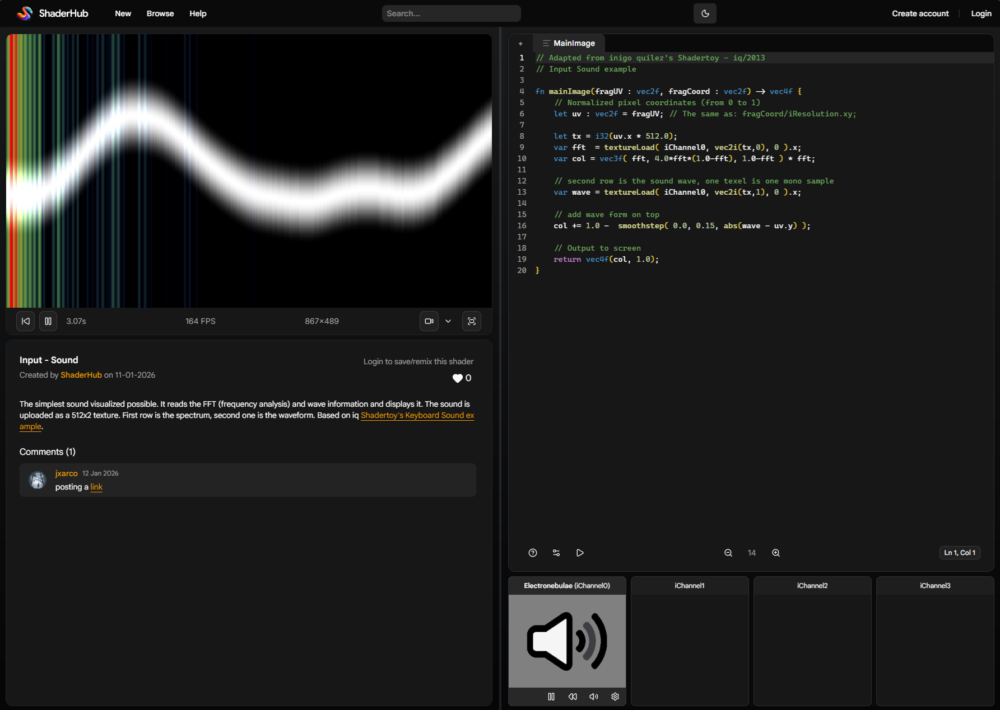
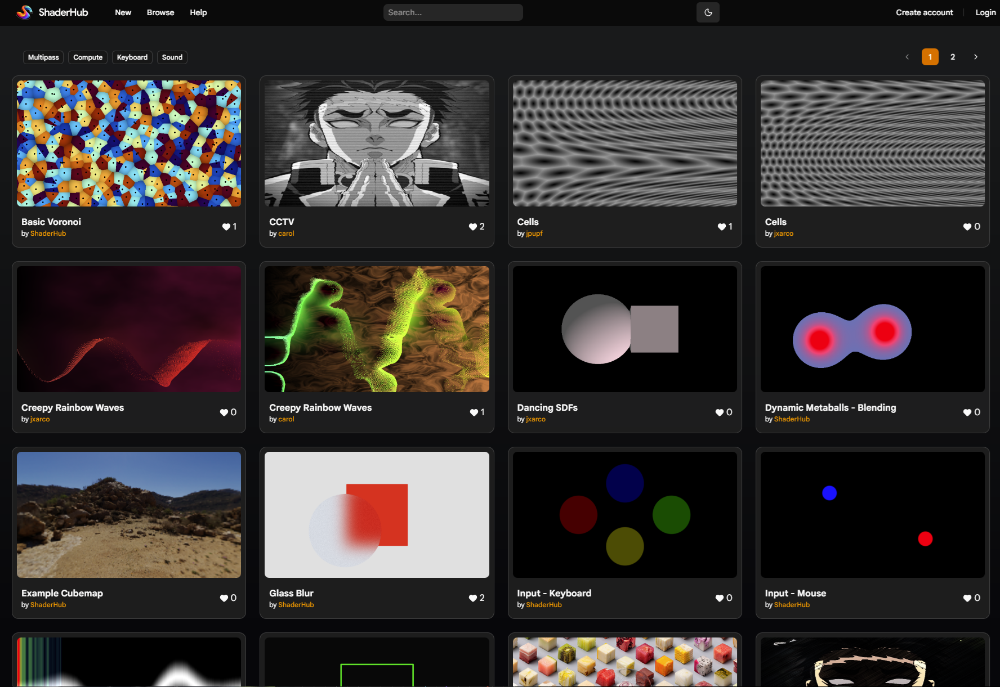

# ShaderHub

Version: 1.2
- Support for Sound Channels
- Shader Comments
- Shader Tags
- User Avatars
- Polished UI using [LexGUI](https://github.com/jxarco/lexgui.js/) v8

ShaderHub is an experimental **WebGPU-based shader playground**. It is designed as a **demo tool** for exploring graphics programming, with a focus on **education and learning WebGPU**, rather than replacing other platforms.

You can test it here: [shaderhub.dev/](https://shaderhub.dev/)

> ⚠️ You will probably find bugs on the way, please report them to this repository issues section!

---

## Features

- **Multi-pass rendering** — supports both fragment and compute passes.
- **Texture & Audio inputs / channels** — attach and use multiple textures in your shaders.
- **Custom uniforms with sliders** — tweak shader parameters interactively.
- **Built-in uniforms** — access time, mouse, and keyboard input directly.
- **Shader sharing & embedding** — share shaders with a link or embed them.
- **Export options** — record shaders to GIF or video.
- **Accounts & remixing** — log in, save your shaders, and remix others'.
- **Shader likes and comments** — users can like and comment from the community.

---

## 📸 Screenshots

---

## Roadmap

- Support "#include" packages
- Support custom texture images (by URL)
- Support video channels